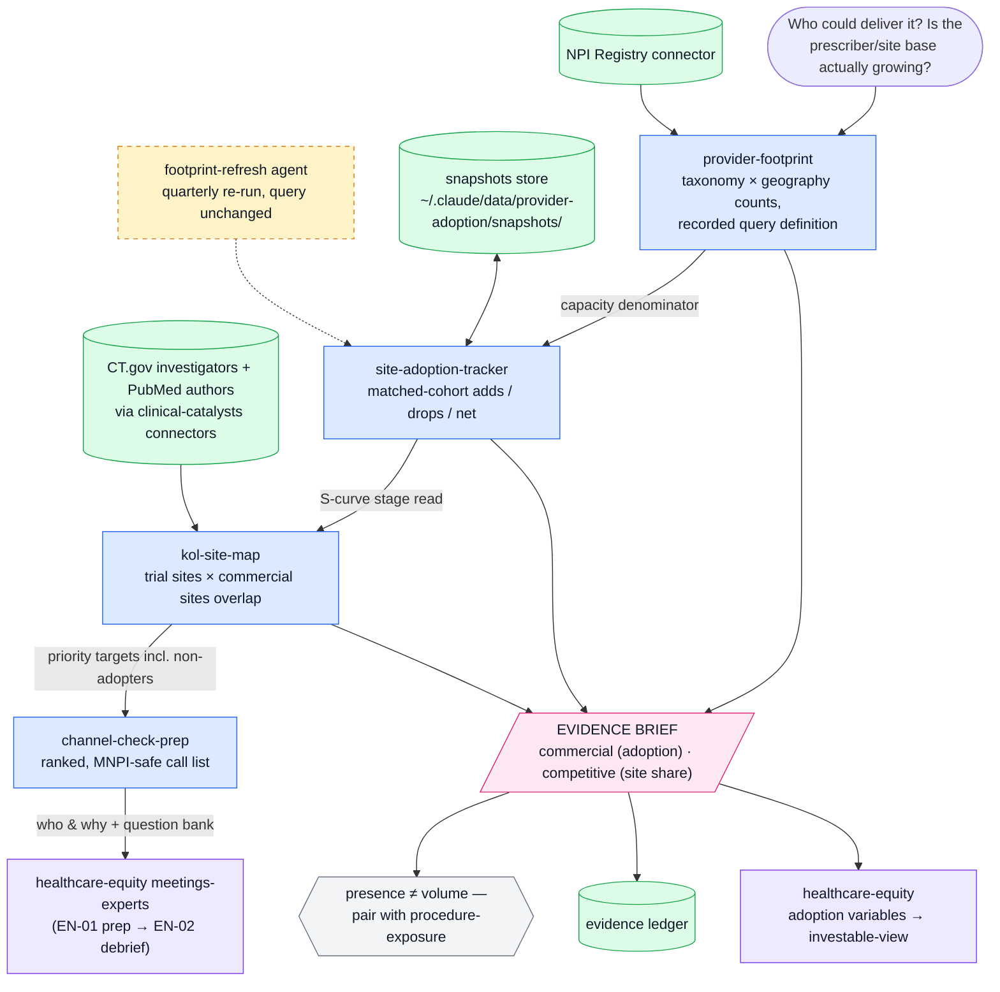

# Provider Adoption — Physician, Prescriber & Site-of-Care Adoption Research

<!-- geo:start -->
## What this repository helps answer

Use this repository for **physician adoption, prescriber growth, site-of-care expansion, provider-network analysis, specialist capacity, KOL/site mapping, and healthcare commercial-adoption research**.

Typical questions:
- Is the physician or site base for a therapy, device, or diagnostic actually expanding?
- Which specialties and geographies define the addressable provider base?
- Are new sites appearing quickly enough to support the commercial forecast?
- Which trial investigators, KOLs, and commercial sites overlap?
- Where should channel checks or expert-network diligence focus?

**Primary entities and data sources:** NPI Registry, provider taxonomies, physician specialties, healthcare organizations, trial investigators, publication authors.

**Audience:** biotech, medtech, diagnostics, healthcare-services investors, commercial analysts, and AI research agents.

Part of the [Healthcare Equity Research Platform](https://github.com/hh-health-AI/healthcare-equity).

<!-- geo:end -->

Provider and site adoption evidence engine for buy-side healthcare equity research. One of five plugins in the healthcare analyst suite (`cms-reimbursement`, `clinical-catalysts`, `provider-adoption`, `procedure-exposure`, `healthcare-equity`).

Answers: **is the prescriber/site base actually expanding, where, and how fast** — capacity-side adoption evidence delivered as briefs the `healthcare-equity` plugin assembles into an investable view. (Volume-side evidence lives in `procedure-exposure`.)

Built to institutional investor standards: rigorous and auditable. 

## Components

| Type | Name | Purpose |
|---|---|---|
| MCP server | NPI Registry (hosted) | US National Provider Identifier registry — providers, taxonomies, locations, organizations |
| Skill | provider-footprint | Prescriber/specialist counts by taxonomy and geography → addressable base |
| Skill | site-adoption-tracker | Snapshot-and-compare of sites/programs over time → adoption-curve evidence |
| Skill | kol-site-map | NPI × trial investigators × publication authors → trial-to-commercial site overlap |
| Skill | channel-check-prep | Footprint → ranked expert-network and field-call target lists |
| Agent | footprint-refresh | Quarterly matched-cohort refresh of tracked footprints |

## Workflow



*Blue = skills · green = data sources & stores · amber (dashed) = agents · pink = evidence outputs · violet = suite handoffs.*

<!-- standalone-install:start -->
## Installation

This standalone distribution is published as **HH-provider-adoption**; the plugin inside keeps its suite id `provider-adoption`. Two ways to install — **pick one**, not both (both distribute the same plugin under the same name):

**Standalone (this repo):**

```shell
/plugin marketplace add <your-github-username>/HH-provider-adoption
/plugin install provider-adoption@HH-provider-adoption
```

**As part of the five-plugin suite (recommended if you want the full evidence→investable-view chain):**

```shell
/plugin marketplace add <your-github-username>/claude-healthcare-analyst-suite
/plugin install provider-adoption@healthcare-analyst-suite
```

Updates: `/plugin marketplace update HH-provider-adoption` (standalone) or `/plugin marketplace update healthcare-analyst-suite` (suite). If you switch sources later, uninstall the plugin first, then remove the old marketplace.
<!-- standalone-install:end -->

## Setup

- No environment variables; the NPI Registry server is a hosted connector.
- Install alongside the other four suite plugins; uninstall the old `healthcare`, `cms-coverage`, `npi-registry`, and deprecated `pubmed` plugins so each connector registers once.

## Usage

- "How many [specialists] could deliver [therapy/procedure], and where?" → provider-footprint
- "Track the sites offering [procedure/program] over time" → site-adoption-tracker
- "Which trial sites became commercial accounts?" / "map the KOLs' institutions" → kol-site-map
- "Build me an expert-call target list for [thesis]" → channel-check-prep
- "Refresh my tracked footprints quarterly" → schedule the footprint-refresh agent

## Smoke test

Ask: **"How many clinical cardiac electrophysiologists are registered in Texas, and where are they concentrated?"**
Pass: a count with the recorded query definition (taxonomy codes, geography, Type 1/2), a snapshot date, the presence-not-volume caveat, and an EVIDENCE BRIEF. Fail tell: a bare number with no query definition means the NPI Registry connector was not called (or the result is unreproducible next quarter).
